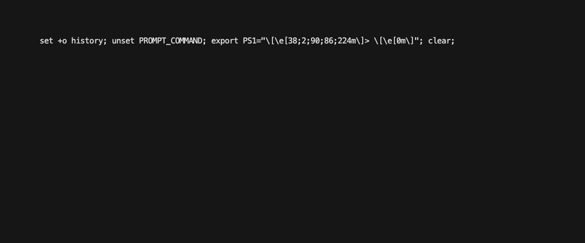

[![Discourse Topics][discourse-shield]][discourse-url]
![Times Downloaded][downloads-shield] ![Issues][issues-shield]
![Latest Releases][release-shield] ![Contributor Shield][contributor-shield]
![License Shield][license-shield]

[discourse-shield]: https://img.shields.io/discourse/topics?label=Discuss%20This%20Tool&server=https%3A%2F%2Fdeveloper.sailpoint.com%2Fdiscuss
[discourse-url]: https://developer.sailpoint.com/discuss
[downloads-shield]: https://img.shields.io/github/downloads/sailpoint-oss/sailpoint-cli/total?label=Downloads
[issues-shield]: https://img.shields.io/github/issues/sailpoint-oss/sailpoint-cli?label=Issues
[release-shield]: https://img.shields.io/github/v/release/sailpoint-oss/sailpoint-cli?label=Current%20Release
[contributor-shield]: https://img.shields.io/github/contributors/sailpoint-oss/sailpoint-cli?label=Contributors
[license-shield]: https://img.shields.io/badge/MIT-License-green

> **CAUTION:** The SailPoint CLI is currently in pre-production and undergoing
> heavy development. Until the CLI reaches version 1.0.0, breaking changes may
> be introduced at any time while we work on refining the CLI.

<!-- PROJECT LOGO -->
<br />
<div align="center">
    

  <h3 align="center">SailPoint CLI - README</h3>
  <br/>
<div align="center">

</div>
</div>

<!-- ABOUT THE PROJECT -->

# About The Project

The SailPoint Command Line Interface (CLI) makes it easy to interact with
SailPoint's SaaS Platform in a programmatic way. Many functions that use to be
accomplished through tools like Postman or from custom scripts can now be done
directly on the command line with minimal setup.

Please use GitHub
[issues](https://github.com/sailpoint-oss/sailpoint-cli/issues) to
[submit bugs](https://github.com/sailpoint-oss/sailpoint-cli/issues/new?assignees=&labels=&template=bug-report.md&title=%5BBug%5D+Your+Bug+Report+Here)
or make
[feature requests](https://github.com/sailpoint-oss/sailpoint-cli/issues/new?assignees=&labels=&template=feature-request.md&title=%5BFeature%5D+Your+Feature+Request+Here).

If you'd like to contribute directly (which we encourage!) please read the
contribution guidelines below, first!

# Contents

- [About The Project](#about-the-project)
- [Contents](#contents)
  - [Installation](#installation)
    - [Homebrew](#homebrew)
    - [Manual Installation](#manual-installation)
      - [MacOS and Linux](#macos-and-linux)
      - [Windows](#windows)
  - [Configuration](#configuration)
    - [Assisted configuration](#assisted-configuration)
      - [Personal Access Token](#personal-access-token)
    - [Manual configuration](#manual-configuration)
    - [Environment variable configuration](#environment-variable-configuration)
  - [Usage](#usage)
  - [Discuss](#discuss)
  - [License](#license)
  - [Contributing](#contributing)
  - [Code of Conduct](#code-of-conduct)

<!-- GETTING STARTED -->

## Installation

There are several ways to install the SailPoint CLI, including through a package manager for your OS of choice or manual installation.

### Homebrew

For Mac OS users, you can use [Homebrew](https://brew.sh/) to install the CLI. Please run the following command in your terminal:

```sh
brew tap sailpoint-oss/tap && brew install sailpoint-cli
```

### Manual Installation

Prebuilt binaries for OS X, Windows, and Linux are provided in our [releases](https://github.com/sailpoint-oss/sailpoint-cli/releases) section. If you download the prebuilt binary, you can skip to the [configuration](#configuration) section. If you want to manually build this project, please follow the steps below.

#### MacOS and Linux

Open your terminal app, navigate to the project directory, and run the following
command:

```shell
make install
```

After that, make sure you can run the `sail` command.

```shell
sail
```

 

#### Windows

Open PowerShell **as administrator**, navigate to the project directory, and run
the following command.

```bash
go build -o "C:\Program Files\sailpoint\sail.exe"
```

After that, add the following directory to the system PATH parameter. You can
find instructions on how to do this from
[this article](https://medium.com/@kevinmarkvi/how-to-add-executables-to-your-path-in-windows-5ffa4ce61a53).
This will only need to be done the first time you install the CLI.

```
C:\Program Files\sailpoint
```

After setting your environment variable, close all instances of your PowerShell
or Command Prompt, open a new instance, and make sure you can run the `sail`
command.

```shell
sail
```

## Configuration

Before you begin, you will need to gather the following information.

- [Find your org/tenant name](https://developer.sailpoint.com/idn/api/getting-started#find-your-tenant-name).
- Pick an Authentication method:
  - PAT: Create a [Personal Access Token](https://developer.sailpoint.com/idn/api/authentication#personal-access-tokens)
  <!-- - OAuth: Create an [OAuth Client](https://developer.sailpoint.com/idn/api/authentication/#authentication-details) -->

Whichever authentication method you choose will be used to authenticate the SailPoint CLI to your IdentityNow tenant.
Take note of the **Client ID** and the **Client Secret**.

<!-- If configuring OAuth additionally note the **Redirect Port** and **Redirect Path** -->

### Assisted configuration

After you have created the Auth Method, run the configure command the corresponds to your chosen authentication method to configure the CLI for your tenant.
This command will create a configuration file in your home directory to store your tenant's connection details.

#### Personal Access Token

```shell
sail configure pat
```


<!-- #### OAuth

```shell
sail configure oauth
```

 -->

### Manual configuration

Alternatively, you can manually create a configuration file in your home
directory.

On **Linux/Mac**, run:

```shell
mkdir ~/.sailpoint
touch ~/.sailpoint/config.yaml
```

On **Windows PowerShell**, run:

```powershell
New-Item -ItemType Directory -Path 'C:\Users\<username>\.sailpoint'
New-Item -ItemType File -Path 'C:\Users\<username>\.sailpoint\config.yaml'
```

The `config.yaml` file should contain the following information.

```yaml
activeenvironment: example # the key that identifies the currently active environment
authtype: pat # currently only pat and pipeline are supported if the ENV VAR SAIL_AUTH_TYPE is configured to "pipeline" it will override this value
customexporttemplatespath: "" # the path to
customsearchtemplatespath: ""
debug: false
environments:
  example:
    baseurl: https://example.api.identitynow.com
    pat:
      accesstoken: example-access-token
      clientid: example-client-id
      clientsecret: example-client-secret
      expiry: example-access-token-expiry
    tenanturl: https://example.identitynow.com
```

### Environment variable configuration

You may also specify environment variables for your configuration. This can
useful when using the CLI in an automated environment, like a CI/CD pipeline,
where consuming the configuration from environment variables would be easier
than creating the config file. Environment variables take precedent over values
defined in a config file.

On **Linux/Mac**, export the following environment variables:

```shell
export SAIL_AUTH_TYPE=pipeline
export SAIL_BASE_URL=https://{org}.api.identitynow.com
export SAIL_CLIENTID={clientID}
export SAIL_CLIENTSECRET={clientSecret}
```

If you want your environment variables to persist across terminal sessions, you
will need to add these exports to your shell profile, like `~/.bash_profile`.

On **Windows PowerShell** run:

```powershell
$env:SAIL_AUTH_TYPE=pipeline
$env:SAIL_BASE_URL=https://{org}.api.identitynow.com
$env:SAIL_CLIENTID={clientID}
$env:SAIL_CLIENTSECRET={clientSecret}
```

If you want your environment variables to persist across PowerShell sessions,
then use the following command instead:

```powershell
[System.Environment]::SetEnvironmentVariable('SAIL_BASEURL','https://{org}.api.identitynow.com')
```

## Usage

Run the `sail` command for an overview of the available commands and flags. You
can use the `-h` flag with any available command to see additional options
available for each command. You can find more information about each command
below.

- [connectors](./cmd/connector/README.md)
- [transforms](./cmd/transform/README.md)

## Discuss

[Click Here](https://developer.sailpoint.com/discuss) to discuss this tool with
other users.

<!-- LICENSE -->

## License

Distributed under the MIT License. See [the license](./LICENSE) for more
information.

<!-- CONTRIBUTING -->

## Contributing

Before you contribute you
[must sign our CLA](https://cla-assistant.io/sailpoint-oss/sailpoint-cli).
Please also read our [contribution guidelines](./CONTRIBUTING.md) for all the
details on contributing.

<!-- CODE OF CONDUCT -->

## Code of Conduct

We pledge to act and interact in ways that contribute to an open, welcoming,
diverse, inclusive, and healthy community. Read our
[code of conduct](./CODE_OF_CONDUCT.md) to learn more.

<p align="right">(<a href="#readme-top">back to top</a>)</p>
