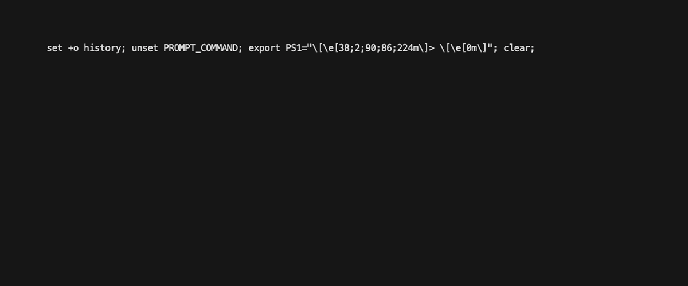

# Transforms

The `transforms` command makes it easy to create, manage, and test transforms. To learn more about transforms, refer to [Transforms](https://developer.sailpoint.com/idn/docs/transforms).

- [Transforms](#transforms)
  - [List transforms](#list-transforms)
  - [Download transforms](#download-transforms)
  - [Create transform](#create-transform)
  - [Update transform](#update-transform)
  - [Delete transform](#delete-transform)
  - [Override transform endpoint flag](#override-transforms-endpoint-flag)

## List transforms

Run the following command to get a list of transforms available in your tenant.

```shell
sail transform list
```

This will produce a table of the available transforms.


## Download transforms

Run the following command to download all of the transforms in your tenant and save them as `json` files on your computer. By default, this command will save the files in the current working directory. Use the `-d` flag to specify a path to an output directory.

```shell
sail transform download -d transform_files
```



This command will overwrite any existing files with the same name, so take care when running this in a directory that has modified transforms that have not yet been saved.

## Create transform

Run the following command to create a new transform from a `json` file. Use the `-f` flag to specify the path to the `json` file.

```shell
sail transform create -f transform.json
```

## Update transform

Run the following command to update a transform from a `json` file. Use the `-f` flag to specify the path to the `json` file.

```shell
sail transform update -f transform.json
```

A common workflow is to download the transforms first, make edits to the transform file, and then use the update command to save those edits in IdentityNow.

## Delete transform

To delete a single transform, run the following command.

```shell
sail transform delete <transform-id>
```

To delete a multiple transforms, use the following syntax.

```shell
sail transform delete <transform-id> <transform-id> <transform-id>
```

This command is commonly used in conjuction with the `ls` command to find the ID of the transform you wish to delete.

```shell
sail transform list
+--------------------------------------+--------------------------+
|                  ID                  |           NAME           |
+--------------------------------------+--------------------------+
| 03d5187b-ab96-402c-b5a1-40b74285d77a | WIFI Group               |
| 06d589cf-4d7d-4b40-8617-c221092ceb2c | Remove Diacritical Marks |
| 1f3a97cf-e58b-4fad-b2f2-0dcc19fb1627 | NETID                    |
+--------------------------------------+--------------------------+
sail transform delete 03d5187b-ab96-402c-b5a1-40b74285d77a
```
## Override transforms endpoint flag

You can append the `--transforms-endpoint` flag, `-e` for short, to override the transforms endpoint. The default endpoint is "/v3/transforms". 


